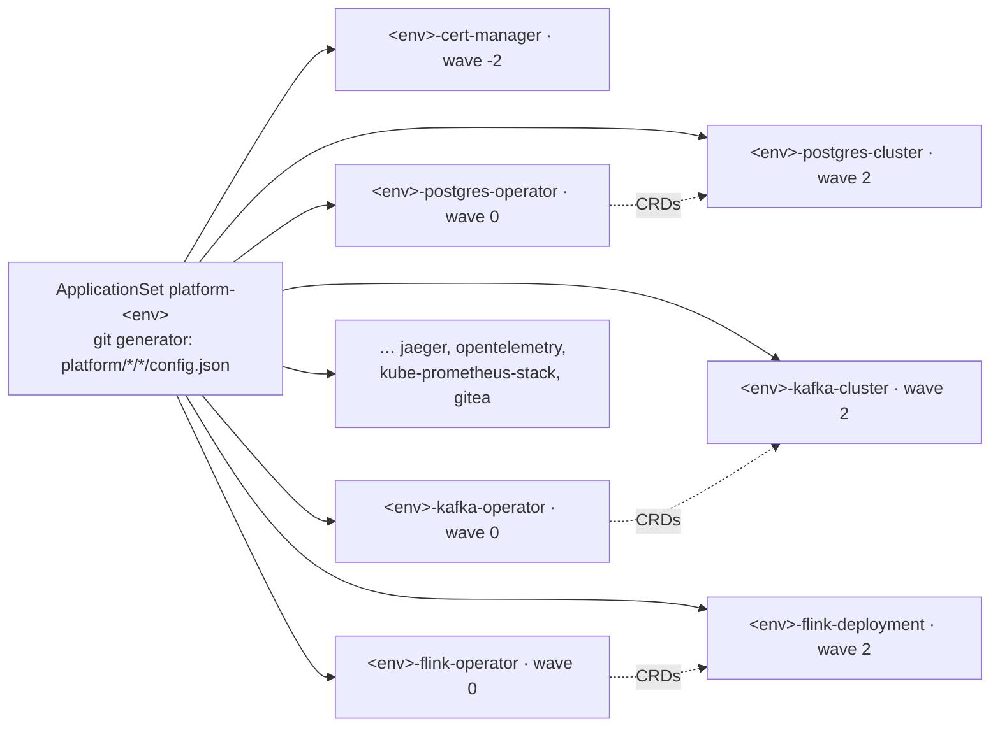
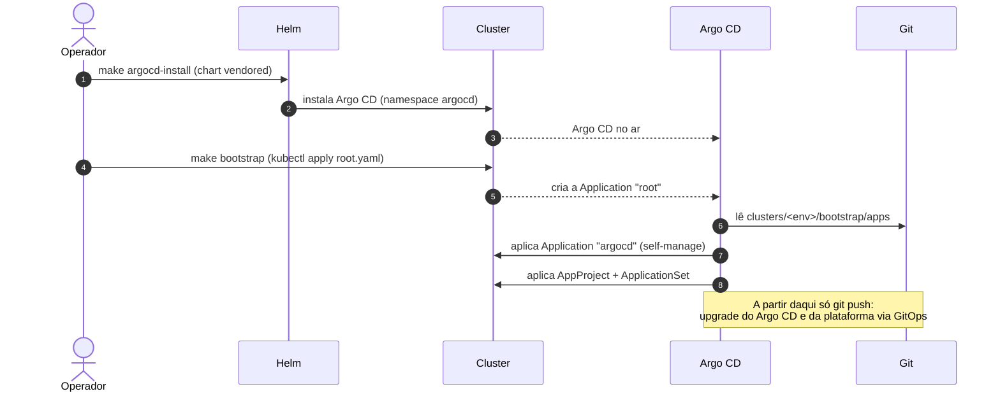

# GitOps Platform

Repositório GitOps que entrega um conjunto de ferramentas de plataforma via
**Argo CD** para três clusters Kubernetes distintos: **dev**, **qa** e **prod**.

> Princípio central: **os mesmos charts rodam nos três ambientes** — a única
> coisa que muda entre clusters é o arquivo `values-<env>.yaml` de cada
> componente.

---

## Sumário

- [Decisões de arquitetura](#decisões-de-arquitetura)
- [Estrutura do repositório](#estrutura-do-repositório)
- [Anatomia de um componente](#anatomia-de-um-componente)
- [Ferramentas instaladas](#ferramentas-instaladas)
- [Como tudo funciona (diagrama)](#como-tudo-funciona-diagrama)
- [Bootstrap do Argo CD (self-managed)](#bootstrap-do-argo-cd-self-managed)
- [Como o Argo CD descobre tudo (ApplicationSet)](#como-o-argo-cd-descobre-tudo-applicationset)
- [Ordenação com sync waves](#ordenação-com-sync-waves)
- [Namespaces](#namespaces)
- [Charts vendored](#charts-vendored)
- [Diferenças por ambiente](#diferenças-por-ambiente)
- [Teste local (kind + Argo CD)](#teste-local-kind--argo-cd)
- [Targets do Makefile](#targets-do-makefile)
- [Como adicionar uma nova ferramenta](#como-adicionar-uma-nova-ferramenta)
- [Multi-cluster real](#multi-cluster-real)
- [Pontos de atenção](#pontos-de-atenção)

---

## Decisões de arquitetura

| Decisão | Escolha | Por quê |
|---|---|---|
| Padrão Argo CD | **ApplicationSet** (um por ambiente) | Escala sem boilerplate — adicionar ferramenta = criar uma pasta. O generator Git detecta sozinho. |
| Origem dos charts | **Vendored** (umbrella chart + `helm dependency build`) | O cluster nunca depende de repositórios Helm públicos no momento do sync. Reprodutível e versionado. |
| Postgres | **CloudNativePG** | Padrão de mercado, alinhado ao fluxo "by operator" (HA, backup, failover nativos). |
| Fluxo das ferramentas | **Operator-first** | Onde há operator, instalamos o operator **e** criamos a instância via CR. |

---

## Estrutura do repositório

```
.
├── clusters/                        # A "engine" (Argo CD) + bootstrap, por cluster
│   ├── dev/
│   │   ├── argocd/                  # umbrella chart do Argo CD (vendored) + values
│   │   │   ├── Chart.yaml
│   │   │   └── values.yaml
│   │   └── bootstrap/
│   │       ├── root.yaml            # app-of-apps raiz (único kubectl apply manual)
│   │       └── apps/                # filhos sincronizados pelo root
│   │           ├── argocd.yaml      #   self-manage do próprio Argo CD
│   │           ├── platform-project.yaml   # AppProject platform-dev
│   │           └── platform-appset.yaml    # ApplicationSet platform-dev
│   ├── qa/   (mesma estrutura)
│   └── prod/ (mesma estrutura + HA no Argo CD)
│
├── platform/                        # As workloads de fato (charts + values)
│   ├── cert-manager/
│   │   └── operator/                # pré-requisito dos webhooks dos operators
│   ├── postgres/
│   │   ├── operator/                # CloudNativePG operator
│   │   └── instance/                # CR Cluster
│   ├── kafka/
│   │   ├── operator/                # Strimzi operator
│   │   └── instance/                # CR Kafka + KafkaNodePool (KRaft)
│   ├── flink/
│   │   ├── operator/                # flink-kubernetes-operator
│   │   └── instance/                # CR FlinkDeployment
│   ├── jaeger/
│   │   ├── operator/                # jaeger-operator
│   │   └── instance/                # CR Jaeger
│   ├── opentelemetry/
│   │   ├── operator/                # opentelemetry-operator
│   │   └── instance/                # CR OpenTelemetryCollector
│   ├── kube-prometheus-stack/
│   │   └── stack/                   # chart único (já inclui o prometheus-operator)
│   └── gitea/
│       └── app/                     # chart único (Gitea não tem operator maduro)
│
├── kind/{dev,qa,prod}.yaml          # clusters locais (3 / 4 / 5 workers)
├── Makefile                         # vendor / lint / kind / argocd
├── .gitignore
└── README.md
```

---

## Anatomia de um componente

Cada **diretório-folha** em `platform/<tool>/<component>/` é **uma Application
do Argo CD**. Sempre contém:

| Arquivo | Função |
|---|---|
| `config.json` | Metadados lidos pelo ApplicationSet: `name`, `tool`, `namespace`, `syncWave`. |
| `Chart.yaml` | Umbrella chart — ou com dependência do chart upstream (operators), ou um chart local com os CRs (instances). |
| `values.yaml` | Defaults comuns aos três ambientes. |
| `values-dev.yaml` | Overrides de dev. |
| `values-qa.yaml` | Overrides de qa. |
| `values-prod.yaml` | Overrides de prod (HA, storage maior, retenção, réplicas…). |
| `templates/` | Apenas nos *instances* — contém o(s) CR(s) aplicado(s) pelo operator. |

Exemplo de `config.json`:

```json
{
  "name": "postgres-operator",
  "tool": "postgres",
  "namespace": "postgres",
  "syncWave": "0"
}
```

---

## Ferramentas instaladas

Onde existe operator, seguimos o **fluxo do operator** e também criamos a
workload **via operator** (operator + instância como Applications separadas).

| Ferramenta | Operator (chart upstream) | Instância (CR) | Namespace |
|---|---|---|---|
| **PostgreSQL** | `cloudnative-pg` | `Cluster` | `postgres` |
| **Apache Kafka (KRaft)** | `strimzi-kafka-operator` | `Kafka` + `KafkaNodePool` | `kafka` |
| **Apache Flink** | `flink-kubernetes-operator` | `FlinkDeployment` (session cluster) | `flink` |
| **Jaeger** | `jaeger-operator` | `Jaeger` | `jaeger` |
| **OpenTelemetry** | `opentelemetry-operator` | `OpenTelemetryCollector` | `opentelemetry` |
| **kube-prometheus-stack** | já inclui o `prometheus-operator` | — (o próprio chart) | `monitoring` |
| **Gitea** | sem operator maduro → Helm chart | — | `gitea` |
| **cert-manager** | `cert-manager` (pré-requisito) | — | `cert-manager` |

> **cert-manager** entra como dependência de plataforma porque os webhooks dos
> operators de Flink, Jaeger e OpenTelemetry precisam de certificados.

Detalhes das instâncias:

- **Postgres**: CR `Cluster` com `instances`, storage e `bootstrap.initdb`
  (cria database/owner inicial) parametrizáveis.
- **Kafka**: modo **KRaft** (sem ZooKeeper) usando `KafkaNodePool` (role
  `controller` + `broker`) + `Kafka` com as annotations
  `strimzi.io/kraft: enabled` e `strimzi.io/node-pools: enabled`. Inclui o
  Entity Operator (topic + user operator).
- **Flink**: `FlinkDeployment` em modo **session cluster** (sem job fixo) — pronto
  para receber jobs. Usa o ServiceAccount `flink` criado pelo chart do operator.
- **Jaeger**: `allInOne` com storage `memory` em dev/qa; `production` em prod
  (aponte para um backend real, ex.: Elasticsearch).
- **OpenTelemetry Collector**: pipeline OTLP (gRPC/HTTP) → exporta **traces** pro
  Jaeger (`otlp/jaeger`) e usa `debug` para métricas/logs. Config inteira fica em
  `values.yaml` (chave `collector.config`), fácil de ajustar por ambiente.

---

## Como tudo funciona (diagrama)

Visão geral — do passo manual único até a plataforma rodando:

```mermaid
flowchart TD
    subgraph OP["👤 Operador · 2 passos imperativos (1x por cluster)"]
        I1["make argocd-install<br/>helm install (chart vendored)"]
        I2["make bootstrap ENV=&lt;env&gt;<br/>kubectl apply root.yaml"]
    end

    subgraph GIT["📦 Git · nochaosio/gitops"]
        ROOT["clusters/&lt;env&gt;/bootstrap/root.yaml<br/><b>app-of-apps</b>"]
        ACDCHART["clusters/&lt;env&gt;/argocd/<br/>chart do Argo CD"]
        PRJ["AppProject<br/>platform-&lt;env&gt;"]
        APPSET["ApplicationSet<br/>platform-&lt;env&gt;"]
        CFG["platform/*/*/config.json<br/>+ values-&lt;env&gt;.yaml"]
    end

    subgraph CL["☸️ Cluster &lt;env&gt; (in-cluster)"]
        ACD["Argo CD"]
        OPER["Applications dos operators<br/>(wave 0)"]
        INST["Applications das instâncias/CRs<br/>(wave 2)"]
        NS["Namespaces: postgres, kafka,<br/>flink, jaeger, opentelemetry,<br/>monitoring, gitea, cert-manager"]
    end

    I1 ==> ACD
    I2 ==> ROOT
    ACD -->|sincroniza continuamente| ROOT
    ROOT --> ACDCHART
    ROOT --> PRJ
    ROOT --> APPSET
    ACDCHART -.->|self-manage / upgrade| ACD
    APPSET -->|lê e gera 1 App por componente| CFG
    APPSET --> OPER
    APPSET --> INST
    OPER -->|instala CRDs / operators| NS
    INST -->|cria os CRs| NS
    OPER -.->|CRD precisa existir antes do CR<br/>(retry/selfHeal)| INST
```

Detalhe da geração de Applications pelo ApplicationSet (fan-out):



## Bootstrap do Argo CD (self-managed)

O Argo CD não consegue sincronizar a si mesmo antes de existir — então o
bootstrap tem **dois passos imperativos feitos uma única vez por cluster**, e
daí em diante tudo é `git push`:



- **Topologia:** um Argo CD por cluster (cada um gerencia só a si mesmo,
  `in-cluster`) — sem credenciais cruzadas.
- **Self-management:** a Application `argocd` aponta para `clusters/<env>/argocd`
  (o próprio chart do Argo CD), então upgrades e mudanças de config viram commit.
  Ela usa `prune: false` de propósito, pra evitar que o Argo CD se auto-delete em
  caso de config quebrada.
- **Engine no mesmo repo:** isolada em `clusters/`, separada de `platform/`.
- **Repos privados:** o Argo CD enxerga repositórios privados via um `Secret` de
  repo-credential (label `argocd.argoproj.io/secret-type: repository`). **Nunca**
  commite em texto puro — use Sealed Secrets, SOPS ou External Secrets.

## Como o Argo CD descobre tudo (ApplicationSet)

Cada ambiente tem **um ApplicationSet** (`clusters/<env>/bootstrap/apps/platform-appset.yaml`)
com um **Git files generator** que varre `platform/*/*/config.json`. Para cada
`config.json` encontrado, gera **uma Application**:

- `metadata.name` → `<env>-<name>` (ex.: `dev-postgres-operator`)
- `source.path` → o diretório do componente (`{{ .path.path }}`)
- `source.helm.valueFiles` → `values.yaml` + `values-<env>.yaml`
- `destination.namespace` → `{{ .namespace }}` (do config.json)
- annotation `argocd.argoproj.io/sync-wave` → `{{ .syncWave }}`

Resultado: **não existe lista manual de Applications**. Criou a pasta com
`config.json`, o ApplicationSet passa a gerenciar.

Política de sync de cada Application gerada:

```yaml
syncPolicy:
  automated: { prune: true, selfHeal: true }
  syncOptions:
    - CreateNamespace=true        # cria o namespace da ferramenta
    - ServerSideApply=true        # CRDs grandes (ex.: kube-prometheus-stack)
    - ApplyOutOfSyncOnly=true
  retry:
    limit: 10
    backoff: { duration: 10s, factor: 2, maxDuration: 5m }
```

---

## Ordenação com sync waves

O campo `syncWave` do `config.json` vira a annotation
`argocd.argoproj.io/sync-wave` da Application:

| Wave | O quê |
|---|---|
| `-2` | **cert-manager** (precisa existir antes dos webhooks dos operators) |
| `0` | **operators** (instalam os CRDs) |
| `1` | **charts standalone** (kube-prometheus-stack, gitea) |
| `2` | **instâncias** (CRs que dependem dos CRDs dos operators) |

> O ApplicationSet **não força** ordenação estrita entre Applications. Por isso
> cada Application também tem `retry` com backoff + `selfHeal`: se um CR
> sincronizar antes do CRD existir, ele simplesmente re-tenta até o operator
> ficar pronto. O sistema é **eventualmente consistente**.

---

## Namespaces

Cada ferramenta vive no **seu próprio namespace**, criado automaticamente
(`CreateNamespace=true`): `postgres`, `kafka`, `flink`, `jaeger`,
`opentelemetry`, `monitoring`, `gitea`, `cert-manager`.

---

## Charts vendored

Os charts upstream são "vendados" para dentro do `charts/` de cada umbrella
chart, então o cluster não acessa repositórios Helm públicos no sync.

```bash
make vendor   # helm repo add + helm dependency build em cada componente
```

Depois disso, faça commit dos `charts/*.tgz` e `Chart.lock` gerados.

> ⚠️ **As versões nos `Chart.yaml` são pontos de partida.** Confirme/atualize
> com `helm search repo <repo>/<chart> --versions` antes de vendar para
> produção. Se uma versão não existir, o `helm dependency build` falha de forma
> clara e basta ajustar.

Versões/repos atuais:

| Componente | Chart | Versão | Repositório |
|---|---|---|---|
| cert-manager | `cert-manager` | `v1.16.2` | https://charts.jetstack.io |
| postgres/operator | `cloudnative-pg` | `0.23.0` | https://cloudnative-pg.github.io/charts |
| kafka/operator | `strimzi-kafka-operator` | `0.45.0` | https://strimzi.io/charts/ |
| flink/operator | `flink-kubernetes-operator` | `1.15.0` | https://downloads.apache.org/flink/flink-kubernetes-operator-1.15.0/ |
| jaeger/operator | `jaeger-operator` | `2.57.0` | https://jaegertracing.github.io/helm-charts |
| opentelemetry/operator | `opentelemetry-operator` | `0.74.0` | https://open-telemetry.github.io/opentelemetry-helm-charts |
| kube-prometheus-stack | `kube-prometheus-stack` | `67.5.0` | https://prometheus-community.github.io/helm-charts |
| gitea | `gitea` | `11.0.1` | https://dl.gitea.com/charts/ |

---

## Diferenças por ambiente

O que varia entre dev/qa/prod (resumo dos `values-<env>.yaml`):

| Componente | dev | qa | prod |
|---|---|---|---|
| Postgres | 1 instância | 2 instâncias, 10Gi | 3 instâncias, 50Gi, limites maiores |
| Kafka | 1 broker, RF=1 | 2 brokers, RF=2 | 3 brokers, RF=3, minISR=2, 100Gi |
| Flink | 2 task slots | 4 slots, 2 TMs | 4 slots, 3 TMs, recursos maiores |
| Jaeger | allInOne/memory | allInOne/memory | production/badger |
| OTel Collector | 1 réplica | 1 réplica | 2 réplicas |
| kube-prometheus-stack | retenção 2d, grafana admin/admin | retenção 5d | retenção 30d, 2 réplicas, storage 50Gi |
| cert-manager | 1 réplica | 1 réplica | 2 réplicas (todos os componentes) |
| Gitea | 1 réplica | 1 réplica | 2 réplicas, 20Gi |

---

## Teste local (kind + Argo CD)

Pré-requisitos: `helm`, `kubectl`, `kind` e (opcional) `argocd` CLI instalados.

```bash
make vendor                 # 1. venda os charts upstream
make lint                   # 2. (opcional) renderiza todo componente localmente
make kind-up                # 3. cria o cluster kind
make argocd-install         # 4. instala o Argo CD
make bootstrap ENV=dev      # 5. aplica AppProject + ApplicationSet de dev
make argocd-password        #    senha inicial do admin
make argocd-ui              #    abre https://localhost:8080 (user: admin)
```

> Antes de aplicar, ajuste o `repoURL` nos arquivos de `clusters/<env>/` para o
> **seu** remote Git (default: `https://github.com/nochaosio/gitops.git`).

---

## Targets do Makefile

| Target | O que faz |
|---|---|
| `make help` | Lista os targets. |
| `make vendor` | `helm repo add` + `helm dependency build` em todos os componentes. |
| `make lint` | Roda `helm template` em todo componente para dev/qa/prod (sem cluster). |
| `make kind-up` / `make kind-down` | Cria / destrói o cluster kind. |
| `make argocd-install` | Instala o Argo CD a partir do chart vendored (igual ao que o Git vai autogerenciar). |
| `make bootstrap ENV=<env>` | Aplica o root app-of-apps do ambiente (entrega tudo ao GitOps). |
| `make argocd-password` | Imprime a senha inicial do admin. |
| `make argocd-ui` | Port-forward da UI para `https://localhost:8080`. |

---

## Como adicionar uma nova ferramenta

1. Crie `platform/<tool>/<component>/` (ex.: `platform/redis/operator/`).
2. Adicione `config.json` (`name`, `tool`, `namespace`, `syncWave`).
3. Adicione `Chart.yaml`:
   - **operator/standalone**: dependência do chart upstream.
   - **instance**: chart local + `templates/` com os CRs.
4. Adicione `values.yaml` + `values-dev.yaml` + `values-qa.yaml` + `values-prod.yaml`.
5. `make vendor` (se tem dependência) e commit.

Pronto — os ApplicationSets dos três ambientes passam a gerenciar o componente
automaticamente, **sem editar nada no bootstrap**.

---

## Multi-cluster real

A topologia adotada é **um Argo CD por cluster** (cada cluster gerencia apenas a
si mesmo, `in-cluster`). Você instala o Argo CD em cada cluster e aplica o
`clusters/<env>/bootstrap/root.yaml` correspondente — nenhuma credencial cruzada
entre clusters.

Se um dia preferir **hub-and-spoke** (um Argo CD central para os três):

1. Registre os clusters no hub (`argocd cluster add <context>`).
2. Em cada `clusters/<env>/bootstrap/apps/platform-appset.yaml`, troque
   `destination.server` pela URL do cluster alvo.
3. Ajuste `destinations` no `AppProject` correspondente para a mesma URL.

---

## Pontos de atenção

- **Versões dos charts** são pontos de partida — verifique antes de produção.
- **`repoURL`** precisa apontar para o seu remote real.
- **Jaeger em prod** com storage `badger` é só placeholder; aponte para um
  backend real (Elasticsearch/Cassandra).
- **Gitea** está configurado self-contained (SQLite + cache/queue em memória)
  para subir fácil; para produção troque por Postgres externo (pode usar o
  próprio CloudNativePG deste repo) e Redis/Valkey.
